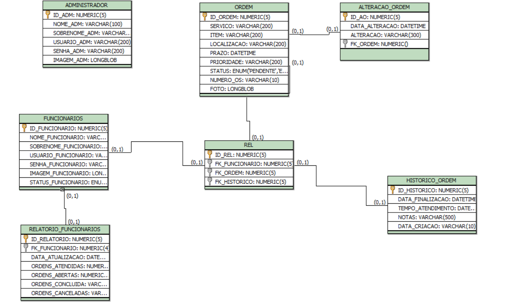

<h1>Order Track</h1>

Desenvolvido utilizando HTML, CSS, JavaScript, PHP, MYSQL e Figma. O sistema oferece uma interface intuitiva e eficiente para os gestores monitorarem e atribuírem tarefas de maneira organizada e os funcionários acompanharem ordens de serviço. Facilitando a comunicação entre equipe e gestores.

<b>Funcionalidades:</b> Abertura de Ordem de Serviço, Lista de Serviços, Administração de Equipe e Relatórios.

<h4>Modelagem Lógica</h4>

  

